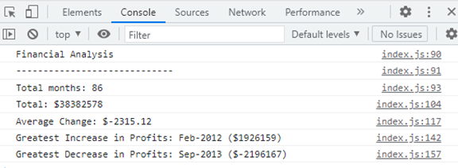

# console-finances

## Description
I used Javascript to analyse data within an array and log various information to the console. The following information is logged within the console:
* The total number of months in the array
* The overall net profit/loss over the entire period
* The average change from month to month
* The largest increase in profit from one month to another
* The largest decrease in profit from one month to another

Please remember to open the console to see outcome of analysis. 

## Screenshot

## Link to deployed website

https://ffionerin.github.io/console-finances/